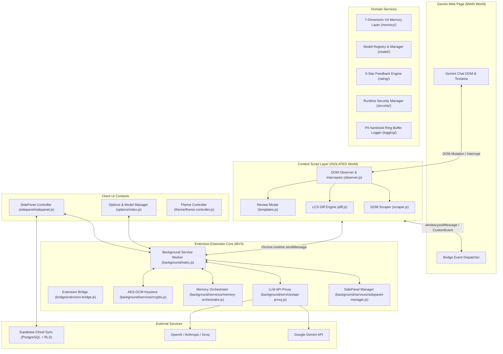
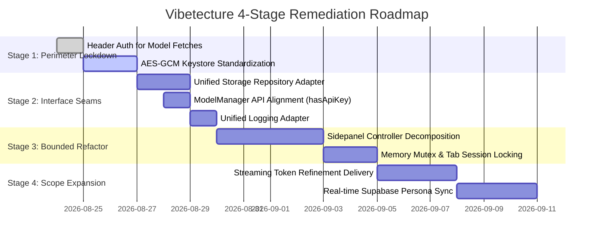

# System Design & Architecture Requirements Document (SDARD)

**Project Name:** gemini-context-aware-extension (`Prompt Persona and Refiner`)  
**Architecture Tier:** Tier 1 (Browser Extension with Multi-Provider Edge Proxy & Cloud Sync)  
**Status:** Active Invariant Contract  
**Last Updated:** 2026-08-24  

---

## 1. Executive Summary & Problem Scope

- **Core Mission:** Deliver intelligent, context-aware prompt refinement and 7-dimension persona synthesis for Google Gemini web interface users via a high-performance Chrome Manifest V3 extension.
- **Topology Root:** `.` (Multi-domain browser extension bundle)
- **Sandbox Zones:** `scratch/**`, `tests/scratch/**`, `.vibetecture/sandbox/**`, `tmp/**`
- **Enforcement Engine:** `vibetecture-guard` supervising pre-diff modifications against `.vibetecture/contract.json`.

---

## 2. System Architecture & Component Topology

---

## 3. Active Architectural Invariants & Boundaries

1. **MV3 Context Isolation:** Content scripts operating in web page context must NEVER store raw API keys or execute unauthenticated external network requests. All LLM proxying and key decryption happens in the background Service Worker.
2. **Deterministic Cryptographic Storage:** Sensitive credentials (API keys, Supabase tokens) are encrypted with Web Crypto API AES-GCM-256 before writing to `chrome.storage.local`.
3. **No Direct Server/DB Imports:** Presentation UI components (`sidepanel/`, `options/`, `content/`) are strictly forbidden from importing `node:*` modules or database drivers (`pg`, `mysql2`, `@prisma/client`).
4. **V4 7-Dimension Schema Contract:** Persona synthesis and context injection must adhere strictly to the 7-dimension schema (`role_definition`, `system_instructions`, `domain_focus`, `interaction_style`, `output_formatting`, `operational_constraints`, `context_anchors`).
5. **PII Sanitization on Logging:** All runtime logs captured by `logging/logger.js` and `background/services/logger.js` must pass through redacting sanitizers before reaching in-memory ring buffers or console outputs.

---

## 4. 7-Dimension Brownfield Diagnostic Assessment

| Dimension | Status | Key Findings & Invariant Violations |
| :--- | :---: | :--- |
| **1. Security & Boundary Leaks** | ⚠️ At Risk | Gemini model dynamic fetch (`model-registry.js:354`) passed API keys in URL query params; XOR keystore in `security/runtime-security.js` is weaker than background AES-GCM. |
| **2. Layer Tangling & Coupling** | ⚠️ Degraded | `sidepanel/sidepanel.js` (8,292 lines) combines UI rendering, M3 modal orchestration, Supabase sync, and memory mutation in a single monolith. |
| **3. Pattern Fragmentation** | ⚠️ Moderate | Multiple concurrent storage layers (`chrome.storage.local`, `session`, `sync`, and `localStorage`) lack a unified Repository abstraction. Dual logger implementations exist. |
| **4. Data Integrity & Topology** | ✅ Healthy | PostgreSQL schema (`supabase/schema.sql`) enforces strict RLS policies and user UUID foreign keys. V3 $\rightarrow$ V4 schema migrators handle backwards compatibility. |
| **5. Concurrency & State Sync** | ⚠️ Moderate | Concurrent sidepanel instances and Gemini chat tabs require mutex-guarded session state to prevent race conditions during auto-refinement. |
| **6. Resilience & Timeouts** | ✅ Healthy | LLM proxy and client implement exponential backoff retry with jitter and JSON auto-repair routines. |
| **7. Dead Code & Ghost Abstractions** | ⚠️ Minor | `ModelManager.hasApiKey` missing method identified; legacy unbundled script paths present alongside `dist/`. |

---

## 5. 4-Stage Remediation Roadmap

---

## 6. Security Threat Model (Red Team Review)

- **Threat 1: Cross-Site Script Injection via Web Page Bridge (`extension-bridge.js`)**  
  *Mitigation:* Strict JSON schema validation, origin check (`window.origin`), and event channel isolation. Raw API keys are never transmitted across the bridge.
- **Threat 2: Local Storage Token Exfiltration via DevTools or Malicious Extensions**  
  *Mitigation:* PBKDF2 salt + AES-GCM 256-bit encryption for all stored provider credentials in `chrome.storage.local`.
- **Threat 3: Supabase Data Tampering (IDOR)**  
  *Mitigation:* Postgres Row Level Security (`auth.uid() = user_id`) on all persona, prompt, and rating tables; public read access restricted to explicitly shared items.
- **Threat 4: Service Worker Lifetime Invalidation**  
  *Mitigation:* Stateless request processing with `chrome.storage.session` state hydration on service worker wake-up.

---

## 7. Architecture Decision Records

- [ADR-001: Baseline Architecture & Manifest V3 Modular Topology](adr/ADR-001-baseline-architecture.md)
- [ADR-002: Web Crypto AES-GCM Credential Keystore & Perimeter Hardening](adr/ADR-002-credential-keystore-hardening.md)

