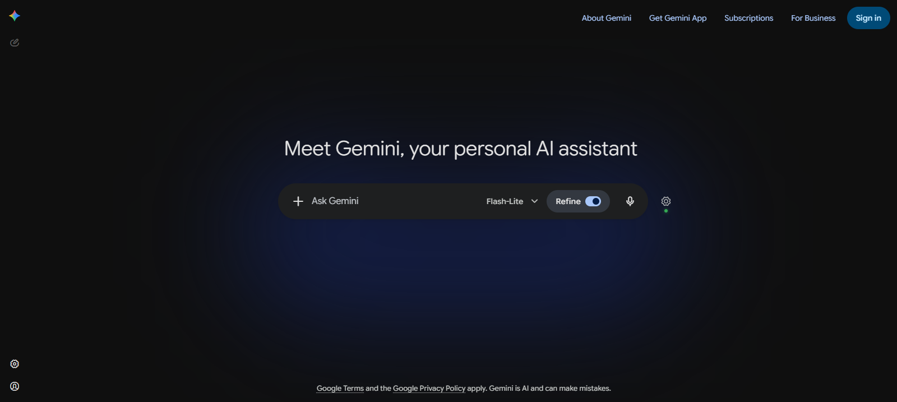
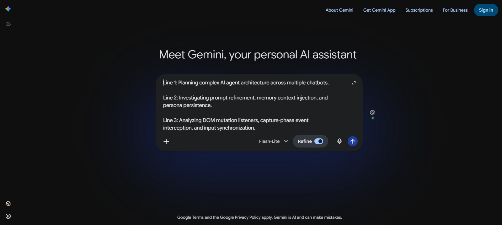
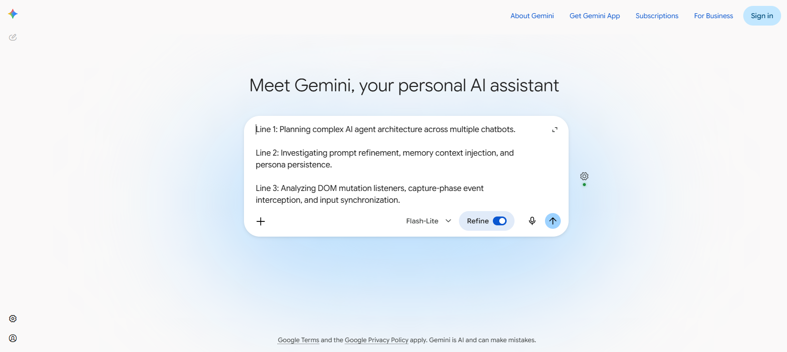

# Google Gemini Platform Adapter Architecture Specification
## Allie Persona & Prompt Refiner

> **Document Status**: Authoritative Engineering Reference  
> **Target Platform**: [Google Gemini (`gemini.google.com`)](https://gemini.google.com/)  
> **Brand Namespace**: `allie` (Rebranded from legacy `pa`; all classes, attributes, and CSS variables use `--allie-*`, `.allie-*`, `data-allie-*`)  
> **Date**: September 2026  

---

## 1. Executive Summary & Architectural Overview

The **Google Gemini Platform Adapter** provides seamless context scraping, prompt interception, and non-intrusive UI injection into Google Gemini's Single Page Application (SPA). Because Gemini is built with Angular (employing `zone.js` and custom internal event dispatchers) and Quill.js (`rich-textarea` with `contenteditable="true"`), standard event bubbling and naive DOM injection fail to intercept user actions reliably.

This document synthesizes real-world DOM reverse-engineering findings and defines the exact contracts for:
1. **DOM Landmarks & Selectors**: Pinpointing the composer, action wrappers, and send triggers.
2. **Material 3 Design Tokens**: Providing 1:1 visual parity across light and dark modes under the `allie` namespace.
3. **Capture-Phase Event Interception**: Intercepting `Enter` keypresses and Send clicks before Angular's event dispatchers can consume them.
4. **Loop-Free Injection Handshake**: Injecting refined prompts into Quill's AST and executing native submissions without trigger recursion.
5. **Dynamic Layout Stability**: Anchoring the Refine Toggle and Settings Button such that multi-line expansion does not break geometry or cause visual clipping.

---

## 2. Visual References

The following high-resolution captures illustrate Gemini's input bar under standard and expanded states, showing the exact positioning of injected controls:

### Dark Mode (Default Composer Height: ~64px)


### Dark Mode (Expanded Multi-Line Height: ~208px)


### Light Mode (Expanded Multi-Line Height: ~208px)


---

## 3. DOM Structure & Hierarchy

Gemini encapsulates its primary chat interface inside deep Angular custom components. The complete ancestral path from `<html>` to the prompt composer is structured as follows:

```
html
└── body.theme-host.dark-theme (or .light-theme)
    └── <chat-app id="app-root">
        └── <main class="chat-app">
            └── <side-navigation-v2>
                └── <bard-sidenav-container data-test-id="bard-sidenav-container">
                    └── <bard-sidenav-content>
                        └── <router-outlet>
                            └── <chat-window>
                                └── <input-area-v2>  ◄── [PRIMARY HOST CONTAINER]
                                    └── .input-area-container
                                        └── .text-input-field  ◄── [SETTINGS ANCHOR]
                                            ├── <rich-textarea>
                                            │   └── .ql-editor[role="textbox"]  ◄── [COMPOSER]
                                            └── .trailing-actions-wrapper  ◄── [ACTION TOOLBAR]
                                                ├── .leading-actions-wrapper (attachments / tools)
                                                ├── .model-picker-container / <bard-mode-switcher>
                                                │
                                                ├── ┌──────────────────────────────────────────────┐
                                                │   │ [INJECTED] .allie-toggle-wrapper (Shadow DOM)│
                                                │   └──────────────────────────────────────────────┘
                                                │
                                                └── .input-buttons-wrapper-bottom
                                                    ├── <speech-dictation-mic-button>
                                                    └── button.send-button  ◄── [SEND BUTTON]
```

### Inner Anatomy of `<input-area-v2>`
- **Top / Center Zone**: Contains `<rich-textarea>` wrapping Quill's contenteditable editor `.ql-editor`.
- **Bottom Action Bar**: Contained within `.trailing-actions-wrapper`, laying out elements horizontally using Flexbox:
  1. Attachment & Tools (`.leading-actions-wrapper`) on the left.
  2. Model Switcher (`.model-picker-container` or `<bard-mode-switcher>`) displaying the active model (e.g., "Flash", "Pro").
  3. **Allie Injection Point**: Inserted directly between the model picker and `.input-buttons-wrapper-bottom`.
  4. Audio dictation & Send triggers (`button.send-button`) on the right.

---

## 4. Exact DOM Landmarks & Selectors

To guarantee resilience against Angular class hashing and minor DOM variations, use the following prioritized selector contracts:

| Landmark Component | Primary Selector | Fallback Selector(s) | Role & Notes |
|--------------------|------------------|----------------------|--------------|
| **Composer Input** | `rich-textarea .ql-editor[role="textbox"]` | `.ql-editor[role="textbox"][aria-label*="prompt" i]`, `rich-textarea [contenteditable="true"]` | Quill editor surface. Read prompt from `.innerText` or `.textContent`. |
| **Send Trigger Button** | `button.send-button` | `button[aria-label*="Send" i]`, `[data-test-id="send-button"]` | Present when input contains text. Replaces speech microphone button. |
| **Refine Toggle Anchor** | `.trailing-actions-wrapper` | `input-area-v2 .trailing-actions-wrapper`, `.input-area-container .bottom-bar` | Insert toggle **before** `.input-buttons-wrapper-bottom` (and immediately **after** `bard-mode-switcher`). |
| **Settings Button Anchor** | `.text-input-field` | `input-area-v2 .text-input-field`, `input-area-v2` | Requires `overflow: visible !important`. Positioned `right: -48px`, centered vertically. |
| **Model Responses** | `.model-response-text` | `model-response`, `[data-role="model"]` | Used for turn scraping and inline rating UI injection. |
| **User Query Turns** | `.query-text` | `.user-query-container`, `[data-role="user"]` | Scraped for conversational context and persona adaptation. |

### Anchor Attachment Code Specification

```typescript
/**
 * Injects the Allie Refine Toggle into Gemini's bottom action bar.
 */
export function mountAllieToggle(toggleElement: HTMLElement): boolean {
  const trailingWrapper = document.querySelector<HTMLElement>('.trailing-actions-wrapper');
  if (!trailingWrapper) return false;

  const buttonsWrapper = trailingWrapper.querySelector<HTMLElement>('.input-buttons-wrapper-bottom');
  if (buttonsWrapper) {
    trailingWrapper.insertBefore(toggleElement, buttonsWrapper);
  } else {
    trailingWrapper.appendChild(toggleElement);
  }
  return true;
}

/**
 * Anchors the Allie Settings Button to the outer perimeter of the composer.
 */
export function mountAllieSettings(settingsElement: HTMLElement): boolean {
  const textInputField = document.querySelector<HTMLElement>('.text-input-field');
  if (!textInputField) return false;

  // Ensure parent allows external button protrusion
  textInputField.style.setProperty('overflow', 'visible', 'important');
  textInputField.appendChild(settingsElement);
  return true;
}
```

---

## 5. Material 3 Design Tokens (Allie Namespace)

All UI elements injected into Gemini MUST adopt native Google Material 3 tokens to match the surrounding system seamlessly. Under the rebrand mandate, all CSS custom properties use the `--allie-*` namespace:

### CSS Token Definition (`tokens.css`)

```css
:host, .allie-gemini-root {
  /* Common Typography */
  --allie-font-family: 'Google Sans Flex', 'Google Sans', system-ui, -apple-system, BlinkMacSystemFont, sans-serif;
  --allie-font-size-sm: 12px;
  --allie-font-size-base: 14px;
  --allie-font-size-lg: 16px;
  --allie-line-height: 1.5;

  /* Pill & Component Radii */
  --allie-radius-pill: 9999px;
  --allie-radius-card: 24px;
  --allie-radius-input: 28px;
  --allie-radius-lg: 32px;

  /* Elevation Shadows */
  --allie-elevation-1: 0 1px 3px rgba(0, 0, 0, 0.12), 0 1px 2px rgba(0, 0, 0, 0.24);
  --allie-elevation-2: 0 3px 6px rgba(0, 0, 0, 0.16), 0 3px 6px rgba(0, 0, 0, 0.23);
  --allie-elevation-3: 0 10px 20px rgba(0, 0, 0, 0.19), 0 6px 6px rgba(0, 0, 0, 0.23);

  /* Status Indicators */
  --allie-status-online: #34a853;
  --allie-status-online-glow: 0 0 6px rgba(52, 168, 83, 0.8);
  --allie-status-offline: #80868b;
  --allie-transition-standard: 200ms cubic-bezier(0.2, 0, 0, 1);
}

/* ==========================================================================
   Dark Theme Tokens (Gemini Default)
   ========================================================================== */
[data-allie-theme="dark"],
body.dark-theme,
:host([data-theme="dark"]) {
  --allie-bg-primary: #131314;
  --allie-bg-surface: #1e1f20;
  --allie-bg-surface-variant: #282a2c;
  --allie-bg-surface-elevated: #303134;

  --allie-text-primary: #e3e3e3;
  --allie-text-secondary: #c4c7c5;
  --allie-text-disabled: #80868b;

  --allie-accent: #8ab4f8;
  --allie-accent-hover: #aecbfa;
  --allie-accent-container: rgba(138, 180, 248, 0.15);
  --allie-accent-contrast: #041e49;

  --allie-hover-state: rgba(255, 255, 255, 0.08);
  --allie-active-state: rgba(138, 180, 248, 0.20);
  --allie-focus-ring: 0 0 0 2px #8ab4f8;

  --allie-border-subtle: rgba(255, 255, 255, 0.12);
  --allie-toggle-bg-off: #444746;
  --allie-toggle-bg-on: #8ab4f8;
  --allie-toggle-knob-off: #c4c7c5;
  --allie-toggle-knob-on: #041e49;
}

/* ==========================================================================
   Light Theme Tokens
   ========================================================================== */
[data-allie-theme="light"],
body.light-theme,
:host([data-theme="light"]) {
  --allie-bg-primary: #f0f4f9;
  --allie-bg-surface: #ffffff;
  --allie-bg-surface-variant: #e1e3e1;
  --allie-bg-surface-elevated: #f8fafd;

  --allie-text-primary: #1f1f1f;
  --allie-text-secondary: #444746;
  --allie-text-disabled: #9aa0a6;

  --allie-accent: #0b57d0;
  --allie-accent-hover: #1b6ef3;
  --allie-accent-container: rgba(11, 87, 208, 0.12);
  --allie-accent-contrast: #ffffff;

  --allie-hover-state: rgba(31, 31, 31, 0.08);
  --allie-active-state: rgba(11, 87, 208, 0.15);
  --allie-focus-ring: 0 0 0 2px #0b57d0;

  --allie-border-subtle: rgba(0, 0, 0, 0.10);
  --allie-toggle-bg-off: #c4c7c5;
  --allie-toggle-bg-on: #0b57d0;
  --allie-toggle-knob-off: #ffffff;
  --allie-toggle-knob-on: #ffffff;
}
```

---

## 6. Event Interception Contract

Gemini's Angular framework binds event handlers directly to the native input element and send button. Angular's `zone.js` schedules microtasks immediately upon target/bubbling-phase event consumption.

```
                  Capture Phase (Downwards)
  Window ──► Document ──► input-area-v2 ──► rich-textarea ──► .ql-editor
     │
     ▼ [Allie Capture Listener: { capture: true }]
     ├─► Intercepts BEFORE Angular
     ├─► Calls e.preventDefault() & e.stopImmediatePropagation()
     └─► Prevents event from reaching Target / Bubble phase!
```

### Why Capture Phase (`{ capture: true }`) is Mandatory
In the standard DOM event model:
1. **Capture Phase**: Event travels down from `window` through ancestors to target.
2. **Target Phase**: Event triggers listeners on the target element.
3. **Bubble Phase**: Event travels up the tree.

Angular attaches component listeners that fire during the **Target** phase. If an extension attaches ordinary bubble-phase listeners (`element.addEventListener('click', handler)`), Angular executes first, submits the chat message to Google's servers, clears the Quill editor, and renders the user turn.

Setting `{ capture: true }` attaches listeners in the downward phase. Allie receives the event at the `document` or `input-area-v2` level before Angular can inspect or react to it.

---

### Enter Keydown Interception Logic

```typescript
export function setupGeminiEnterInterceptor(
  inputEl: HTMLElement,
  isAllieRefineActive: () => boolean,
  triggerRefinementModal: (rawPrompt: string) => Promise<void>
): () => void {
  const handleKeydown = async (e: KeyboardEvent) => {
    // 1. Shift+Enter should create a newline; only intercept standalone Enter
    if (e.key !== 'Enter' || e.shiftKey) return;

    // 2. If refinement toggle is inactive, allow native Gemini submission
    if (!isAllieRefineActive()) return;

    // 3. Inspect editor contents
    const text = inputEl.innerText?.trim() || '';
    if (!text) return; // Do not intercept empty Enter (native clears or ignores)

    // 4. Halt Angular & Quill completely
    e.preventDefault();
    e.stopPropagation();
    e.stopImmediatePropagation();

    // 5. Open Allie Prompt Refinement workflow
    await triggerRefinementModal(text);
  };

  inputEl.addEventListener('keydown', handleKeydown, { capture: true });
  return () => inputEl.removeEventListener('keydown', handleKeydown, { capture: true });
}
```

---

### Send Button Click Interception Logic & Loop Prevention

When the user reviews the prompt and approves submission inside the Allie modal, Allie must insert the refined text and submit the prompt without re-triggering the interceptor. This is accomplished via a module-scoped `skipNextRefinement` guard flag:

```typescript
let skipNextRefinement = false;

/**
 * Intercepts manual clicks on Gemini's Send button.
 */
export function setupGeminiSendButtonInterceptor(
  sendBtn: HTMLElement,
  inputEl: HTMLElement,
  isAllieRefineActive: () => boolean,
  triggerRefinementModal: (rawPrompt: string) => Promise<void>
): () => void {
  const handleClick = async (e: MouseEvent) => {
    // 1. If Allie is executing a programmatic submission, bypass interceptor
    if (skipNextRefinement) {
      skipNextRefinement = false; // Reset guard flag for future turns
      return; // Allow native Angular submission handler to run
    }

    // 2. Only intercept if Refine toggle is active
    if (!isAllieRefineActive()) return;

    // 3. Verify non-empty prompt
    const text = inputEl.innerText?.trim() || '';
    if (!text) return;

    // 4. Halt native Angular submission
    e.preventDefault();
    e.stopPropagation();
    e.stopImmediatePropagation();

    // 5. Launch refinement modal
    await triggerRefinementModal(text);
  };

  sendBtn.addEventListener('click', handleClick, { capture: true });
  return () => sendBtn.removeEventListener('click', handleClick, { capture: true });
}
```

---

### Quill Editor Text Injection Protocol (`triggerNativeSend`)

Gemini uses Quill.js to manage its contenteditable rich text area. Modifying `inputEl.value` fails because Quill maintains an internal Delta tree and does not expose a standard HTML `<textarea>`. Modifying `innerText` alone fails to trigger Angular's form-dirty change detection.

The exact injection sequence required:

```typescript
/**
 * Injects refined prompt text into Gemini's Quill editor and triggers submission.
 */
export function triggerNativeGeminiSend(
  inputEl: HTMLElement,
  sendBtn: HTMLElement,
  refinedPrompt: string
): void {
  // 1. Raise loop-prevention guard flag
  skipNextRefinement = true;

  // 2. Focus the editor surface
  inputEl.focus();

  // 3. Quill formats lines inside <p> elements. Wrap text to match Quill schema.
  // Splitting by newlines ensures multi-line prompts preserve paragraph structure.
  const paragraphs = refinedPrompt
    .split('\n')
    .map(line => `<p>${line.length > 0 ? escapeHtml(line) : '<br>'}</p>`)
    .join('');

  inputEl.innerHTML = paragraphs;

  // 4. Dispatch synthetic InputEvents with bubble support to notify Quill & Angular
  inputEl.dispatchEvent(
    new InputEvent('input', {
      bubbles: true,
      cancelable: true,
      inputType: 'insertFromPaste',
      data: refinedPrompt
    })
  );
  inputEl.dispatchEvent(new Event('change', { bubbles: true }));

  // 5. Small delay to let Angular finish change detection cycle before triggering click
  setTimeout(() => {
    sendBtn.click();
  }, 150);
}

function escapeHtml(str: string): string {
  return str
    .replace(/&/g, '&amp;')
    .replace(/</g, '&lt;')
    .replace(/>/g, '&gt;')
    .replace(/"/g, '&quot;')
    .replace(/'/g, '&#039;');
}
```

---

## 7. Dynamic Layout & Expansion Behavior

A critical engineering failure in previous implementations occurred when users typed lengthy prompts: the input container expanded from `64px` upwards to `208px+`, causing fixed buttons to overlap text, get clipped, or drift out of alignment.

### Container Expansion Dynamics

```
Default Height (~64px):
┌─────────────────────────────────────────────────────────────┐
│  .text-input-field                                          │
│  [ Composer: 1 line of prompt text ]                        │  ⚙ [Allie Settings]
│  [+] ... [Flash ˇ]  [.allie-toggle]  (mic)  (↑ Send)        │  (Centered at y: 32px)
└─────────────────────────────────────────────────────────────┘

Expanded Multi-Line Height (~208px):
┌─────────────────────────────────────────────────────────────┐
│  .text-input-field                                          │
│  [ Composer: Line 1 ... ]                                   │
│  [ Line 2 ...           ]                                   │
│  [ Line 3 ...           ]                                   │  ⚙ [Allie Settings]
│  [ Line 4 ...           ]                                   │  (Tracked to y: 104px)
│  [ Line 5 ...           ]                                   │
│  [+] ... [Flash ˇ]  [.allie-toggle]  (mic)  (↑ Send)        │
└─────────────────────────────────────────────────────────────┘
```

### Dynamic Anchoring Rules

1. **Refine Toggle (`.allie-toggle-wrapper`)**:
   - Anchored inside `.trailing-actions-wrapper`.
   - `.trailing-actions-wrapper` is aligned to `align-self: flex-end` / bottom of `<input-area-v2>`.
   - As the editor expands upwards/downwards, `.trailing-actions-wrapper` remains naturally anchored at the bottom edge.
   - The toggle stays horizontally aligned next to the model switcher and send button at all heights.

2. **Settings Button (`.allie-settings-button`) Anchoring**:
   - **Method A (CSS Anchor, Preferred)**:
     - Anchor directly inside `.text-input-field`.
     - Set `.text-input-field { overflow: visible !important; position: relative; }`.
     - Style `.allie-settings-button`:
       ```css
       .allie-settings-button {
         position: absolute;
         right: -48px;
         top: 50%;
         transform: translateY(-50%);
         z-index: 1000;
       }
       ```
     - With `top: 50%; transform: translateY(-50%)`, CSS automatically centers the gear button on the vertical midline of the expanding container without requiring JavaScript resize listeners.
   - **Method B (JS Coordinate Tracking, Fallback)**:
     - When anchored to `document.body` with `position: fixed`:
       ```typescript
       function updateAllieSettingsPosition(container: HTMLElement, settingsBtn: HTMLElement) {
         const rect = container.getBoundingClientRect();
         settingsBtn.style.left = `${rect.right + 12}px`;
         settingsBtn.style.top = `${rect.top + rect.height / 2 - 20}px`;
       }
       ```
     - A `ResizeObserver` attached to `input-area-v2` guarantees smooth repositioning during live text typing.

---

## 8. Summary of Platform Adapter Implementation Checklist

When implementing `GeminiPlatformAdapter` in `src/adapters/chatbots/gemini.adapter.ts`:

- [x] **Namespace**: All classes, CSS variables, and dataset attributes use `allie` (zero instances of legacy `pa`).
- [x] **Landmark Selectors**:
  - Input: `rich-textarea .ql-editor[role="textbox"]`
  - Send Button: `button.send-button`, `button[aria-label*="Send"]`
  - Toggle Anchor: `.trailing-actions-wrapper` before `.input-buttons-wrapper-bottom`
  - Settings Anchor: `.text-input-field` (with `overflow: visible !important`)
- [x] **Theme Sync**: Material 3 tokens supporting both `.dark-theme` (`#131314` / `#1e1f20`) and `.light-theme` (`#f0f4f9` / `#ffffff`).
- [x] **Interception**: Capture phase (`{ capture: true }`) applied to `keydown` (Enter) and `click` (Send button).
- [x] **Loop Guard**: `skipNextRefinement` boolean handshake used during `triggerNativeGeminiSend`.
- [x] **Quill Delta Sync**: Formatted `<p>` elements injected alongside `InputEvent('input', { bubbles: true, inputType: 'insertFromPaste' })`.
