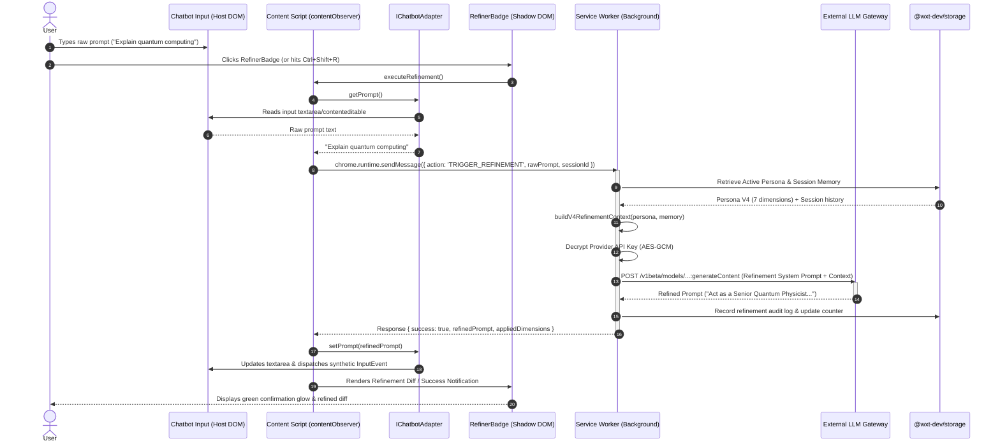
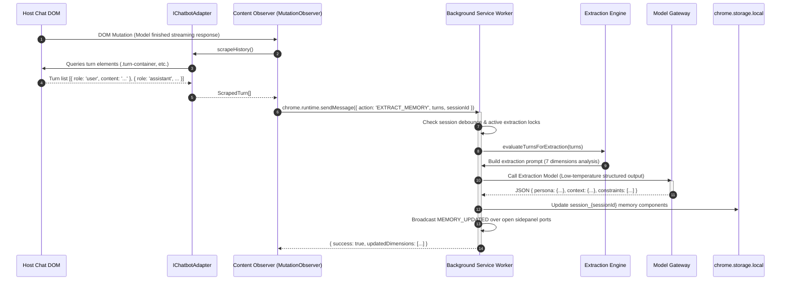
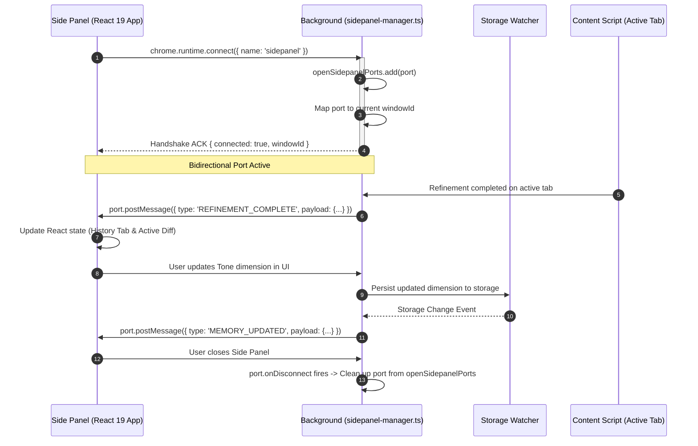
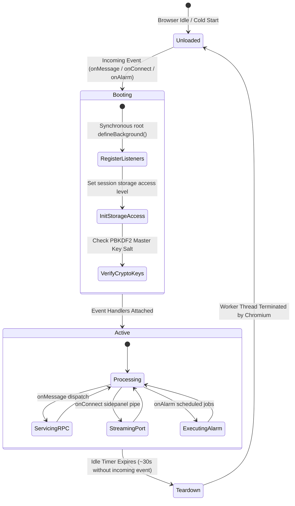
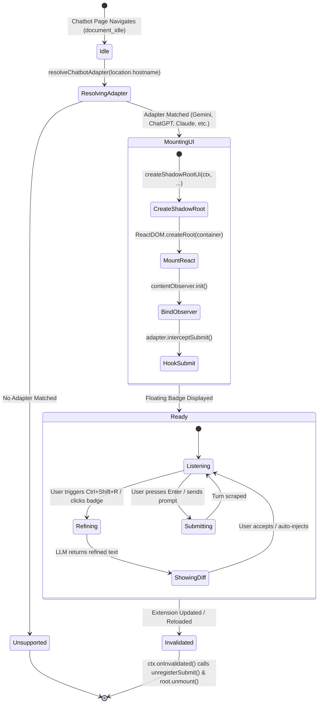

# 00 - Allie Persona & Prompt Refiner: System Design & Architecture Blueprint

> **System Target**: Web Extension Manifest V3 (MV3) Architecture  
> **Core Framework**: [WXT (Web Extension Toolbox) v0.21.4](https://wxt.dev/) · Vite 6 · React 19 · TypeScript 5.7+  
> **Authoritative Root**: `wxt-extension/`  
> **Classification**: Master Technical System Design Specification

---

## 1. System Overview & Architectural Invariants

**Allie Persona & Prompt Refiner** is an enterprise-grade, browser-integrated AI context orchestration platform. It operates across multiple isolated browser security boundaries to observe, harvest, extract, and refine AI interaction contexts across major conversational AI platforms.

```
┌────────────────────────────────────────────────────────────────────────────────────────────────────────┐
│                                       Multi-Context Process Model                                      │
├───────────────────────────────────┬────────────────────────────────────────────────────────────────────┤
│ Host Page Worlds (Unprivileged)   │ Isolated Extension Worlds (Privileged)                             │
│                                   │                                                                    │
│  ┌─────────────────────────────┐  │  ┌─────────────────────────────┐  ┌─────────────────────────────┐  │
│  │ Host Page DOM & SPA Engine  │  │  │ Content Script World        │  │ Extension Origin Windows    │  │
│  │ (Gemini, ChatGPT, Claude)   │  │  │ (entrypoints/content.ts)    │  │ (Sidepanel, Popup, Options) │  │
│  │                             │  │  │                             │  │                             │  │
│  │  ┌───────────────────────┐  │  │  │  ┌───────────────────────┐  │  │  ┌───────────────────────┐  │  │
│  │  │ Platform DOM Elements │  │  │  │  │ Platform Adapters     │  │  │  │ React 19 UI Engine   │  │  │
│  │  │ (Inputs, Turns, Diff) │◄─┼──┼──┼─►│ (IChatbotAdapter)     │  │  │  │ 3-Tab Side Panel     │  │  │
│  │  └───────────────────────┘  │  │  │  └──────────┬────────────┘  │  │  │ Quick-Toggle Popup    │  │  │
│  │                             │  │  │             │               │  │  │ Options Dashboard     │  │  │
│  │  ┌───────────────────────┐  │  │  │             ▼               │  │  └──────────┬────────────┘  │  │
│  │  │ Injected Shadow DOM   │  │  │  │  ┌───────────────────────┐  │  │             │               │  │
│  │  │ <prompt-refiner-ui>   │◄─┼──┼──┼─►│ createShadowRootUi    │  │  │             │               │  │
│  │  │ Isolated CSS Styles   │  │  │  │  │ (Floating Badge/Diff) │  │  │             │               │  │
│  │  └───────────────────────┘  │  │  │  └───────────────────────┘  │  │             │               │  │
│  └─────────────────────────────┘  │  └─────────────┬───────────────┘  └─────────────┼───────────────┘  │
│                                   │                │                                │                  │
│                                   │                ▼                                ▼                  │
│                                   │  ┌──────────────────────────────────────────────────────────────┐  │
│                                   │  │ Background Service Worker (entrypoints/background.ts)        │  │
│                                   │  │  - Memory Orchestrator      - API Proxy & LLM Gateway        │  │
│                                   │  │  - Web Crypto AES-GCM Vault - Session State Manager          │  │
│                                   │  │  - Sidepanel Port Router    - Harvest Extraction Engine      │  │
│                                   │  └──────────────────────────────┬───────────────────────────────┘  │
│                                   │                                 │                                  │
│                                   │                                 ▼                                  │
│                                   │       Type-Safe Storage (@wxt-dev/storage / Chrome Storage)        │
└───────────────────────────────────┴─────────────────────────────────┼──────────────────────────────────┘
                                                                      │ HTTPS / WSS
                                                                      ▼
                                    ┌────────────────────────────────────────────────────────────────────┐
                                    │ External Cloud & Model Providers                                   │
                                    │  - Google Gemini API (generativelanguage.googleapis.com)           │
                                    │  - OpenAI API (api.openai.com) / Anthropic API (api.anthropic.com) │
                                    │  - OpenRouter Gateway (openrouter.ai)                              │
                                    │  - Supabase BaaS (Postgres RLS Database & Community Personas)      │
                                    └────────────────────────────────────────────────────────────────────┘
```

### Core Architectural Invariants

1. **Manifest V3 Ephemeral Lifecycle Invariant**: The Background Service Worker (`entrypoints/background.ts`) is stateless and may be terminated by Chromium after ~30 seconds of inactivity. Operational state must never rely on in-memory global variables. All session data is persisted in `chrome.storage.session` and `chrome.storage.local`.
2. **Synchronous Registration Invariant**: All event listeners (`browser.runtime.onMessage`, `browser.runtime.onConnect`, `browser.action.onClicked`, `browser.commands.onCommand`) **must** be registered synchronously at the root execution scope of `defineBackground()`.
3. **Shadow DOM Presentation Boundary**: In-page injected components (`RefinerBadge`, `RatingOverlay`) **must** mount inside a clean-room Shadow Root created via `createShadowRootUi(ctx, ...)`. Host application CSS rules and CSS resets must never contaminate extension UI, and extension styles must never leak into host DOM.
4. **Context Invalidation Cleanup**: All Content Script observers, event handlers, and port connections must be bound to `ctx.onInvalidated()` to prevent memory leaks and `Extension context invalidated` runtime errors.
5. **Zero-Trust Client Cryptography**: API keys must be encrypted locally via Web Crypto AES-GCM (256-bit) before storage, decrypted only in volatile memory inside the Service Worker during active HTTP dispatches, and never exposed to host DOM or content scripts.

---

## 2. Process Boundaries & Context Topologies

### 2.1 Context Segregation Matrix

| Execution Context | Thread / Process | Script Entrypoint | Permissions & Capabilities |
| :--- | :--- | :--- | :--- |
| **Background Service Worker** | Dedicated Extension Service Worker Thread | `entrypoints/background.ts` | Full WebExtension APIs (`storage`, `tabs`, `sidePanel`, `scripting`, `crypto`). Cross-origin networking without CORS restrictions. |
| **Content Script** | Tab Renderer Thread (Isolated World) | `entrypoints/content.ts`<br>`entrypoints/*.content/` | Direct access to host DOM. Isolated JS scope (cannot inspect or alter host JS variables directly). Proxies WebExtension calls via `chrome.runtime`. |
| **Injected UI (Shadow DOM)** | Tab Renderer Thread (Shadow Root) | `src/components/injections/` | Rendered within host page tree inside open Shadow Root. Encapsulated CSS. Access to content script scope. |
| **Side Panel Window** | Extension Tab Renderer Thread | `entrypoints/sidepanel/` | Full Chrome APIs (`chrome.sidePanel`, `chrome.tabs`, `chrome.storage`). Persistent across tab navigation within the active window. |
| **Action Popup Window** | Ephemeral Browser Toolstrip Window | `entrypoints/popup/` | Full Chrome APIs. Auto-closes on click outside window. |
| **Options Page** | Dedicated Tab / Options Dialog | `entrypoints/options/` | Full Chrome APIs. Renders full-screen credential, model, and persona manager. |

---

## 3. End-to-End Sequence Workflows

### 3.1 Prompt Refinement Flow (Submit Interception & In-Page Refinement)

The primary interaction cycle begins when a user enters a raw prompt into any supported chatbot input (Gemini, ChatGPT, Claude, etc.) and triggers refinement (via shortcut `Ctrl+Shift+R`, clicking the floating badge, or intercepting native submit).



---

### 3.2 Automated Conversation Harvesting & Persona Memory Extraction

As conversation turns progress, the extension automatically observes new messages, extracts implicit user constraints and background knowledge, and updates the active session memory.



---

### 3.3 Persistent Side Panel Live Synchronization

The Side Panel maintains a stateful real-time connection to the Background Service Worker via Chrome Extension Ports (`chrome.runtime.Port`), ensuring instant UI updates when turns are scraped or refined.



---

## 4. State Machines & Lifecycle Models

### 4.1 Background Service Worker MV3 State Machine



### 4.2 Injected Shadow DOM UI Lifecycle State Machine



---

## 5. Storage Topology & Data Synchronization Architecture

The storage subsystem coordinates three distinct storage tiers with varying durability and visibility scopes:

```
┌────────────────────────────────────────────────────────────────────────────────────────────────────────┐
│                                       Storage Architecture                                             │
├───────────────────────────────┬───────────────────────────────┬────────────────────────────────────────┤
│ chrome.storage.session        │ chrome.storage.local          │ Remote Supabase (BaaS)                 │
├───────────────────────────────┼───────────────────────────────┼────────────────────────────────────────┤
│ - Ephemeral In-Memory Storage │ - Persistent Disk Storage     │ - Cloud PostgreSQL Database            │
│ - Cleared on browser restart  │ - Survives browser restarts   │ - Synchronized via JWT & RLS           │
│ - Shared across contexts via  │ - Quota: unlimitedStorage     │ - Community persona marketplace        │
│   TRUSTED_AND_UNTRUSTED_LEVEL │ - Scoped keys per namespace   │ - Aggregated rating ledgers            │
├───────────────────────────────┼───────────────────────────────┼────────────────────────────────────────┤
│ Keys:                         │ Keys:                         │ Tables:                                │
│ • refinementCounter           │ • local:active_persona        │ • public.personas (Community Hub)      │
│ • activeSessionId             │ • local:personas              │ • public.ratings (Feedback Ledger)     │
│ • activeTabWindowMap          │ • session_{sessionId}         │ • auth.users (PKCE Auth Sessions)      │
│ • splitViewActive             │ • enc:v1:geminiApiKey         │                                        │
│                               │ • user_settings               │                                        │
└───────────────────────────────┴───────────────────────────────┴────────────────────────────────────────┘
```

---

## 6. Security Architecture & Threat Mitigations

| Threat Vector | Severity | Architectural Mitigation in Allie Refiner |
| :--- | :--- | :--- |
| **Host Page Script Tampering (XSS)** | High | Content scripts run in **Isolated World**. Host JavaScript execution scopes cannot read, prototype-pollute, or intercept variables in the extension content script. |
| **CSS Collision & Style Bleed** | High | All in-page UI is mounted in an isolated **Shadow Root** (`createShadowRootUi`). Host Tailwind/reset styles cannot pierce the shadow boundary. |
| **API Key Theft from Extension Storage** | Critical | Keys are encrypted via **AES-GCM (256-bit)** using PBKDF2 derived keys (`crypto.subtle`). Never stored in plaintext. |
| **Extension Context Invalidation Crashing** | Medium | All listeners, DOM observers, and submit hooks are registered through WXT's `ContentScriptContext` (`ctx.onInvalidated()`) for graceful unmounting. |
| **CORS Policy Restrictions on LLM Calls** | Medium | All model API requests (`generativelanguage.googleapis.com`, `api.openai.com`, etc.) are routed through the **Background Service Worker**, utilizing declared `host_permissions`. |

---

## 7. Performance & Resource Budgets

1. **Cold-Start Service Worker Latency**: $\le 45\text{ms}$ from event trigger to listener execution.
2. **Refinement Pipeline Overhead**: $\le 120\text{ms}$ internal processing overhead (excluding external LLM network latency).
3. **DOM Mutation Observer Throttling**: Mutation events debounced to a minimum window of $250\text{ms}$ to prevent CPU saturation on high-frequency streaming turns.
4. **Shadow DOM Memory Footprint**: Injected React root consumes $\le 3.5\text{MB}$ heap memory per tab.
5. **Production Bundle Size**: Total compiled bundle (all entrypoints, React 19, icons, and vendor runtime) strictly bounded to $\le 2.50\text{MB}$ (currently **2.30 MB**).
